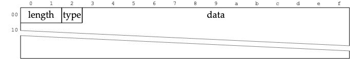
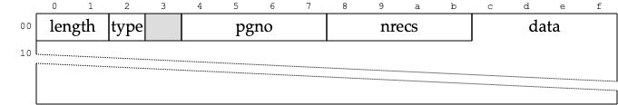
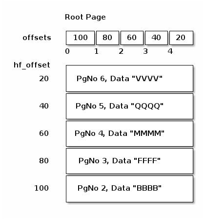

# Implementation of Berkley DB

Run the following command:

```bash
./gendata.py | db_load -T -t btree testdata.bdb
```

run the following command:
```bash
cd bdb-rs && cargo run -- ../testdata.bdb
```

reference to the following link for more information: https://transactional.blog/building-berkeleydb/


## Overview
## Why BerkeleyDB?
BerkeleyDB is ubiquitous. It’s installed on every platform, or easily installable, and there’s bindings available to it in nearly every language.

BerkeleyDB is simple. It’s not a highly optimized B-Tree implementation. 
It isn’t tuned or written with any one data model in mind. The B-Tree is a 
plain key-value store.


BerkeleyDB is realistic. It’s been used in real-world applications. 
Features were added to it according to the needs of real software. 
It influenced the design and of other embedded databases. What one learns 
from BerkeleyDB will be applicable to other, more complicated B-Trees.

### Metapage 

This is the metapage


The gap start on byte 460.
The entire structure is 512 bytes in size. 
The rest of the 4096 byte page is unspecified and unused. 

12-15 byte range: Magic Number
It should always be 0x53162. This magic number is also unique to the Btree data type, so requiring this magic number makes sure that the file is not one of the alternative access methods supported by BerkeleyDB (hash, record, or queue).

28-31 byte range: Free list page number
This will be used once mutations are implemented on the btree.

32-35 byte range: Last page number
The page number of the last page in the database. This can be used instead of relying on size_of_database_file / 4KB - 1.

88-91: Root
The page number of the root of the btree. Reads of the btree should start from this page.


### BTree page


The rest of the page is used to hold the page entries, which is the subject of our next step. For now, we only focus on the page headers. No bolding of fields this time, as all of them will be used.

00-07: Log sequence number
The sequence number of this page, which will become important once updates and WAL support is implemented.

08-11: Current page number
The page number of this page.

12-15: Previous page number
The leaf page containing lexicographically lower data. 0 if none, or if internal node.

16-19: Next page number
The leaf page containing lexicographically higher data. 0 if none, or if internal node.

20-21: Number of items on the page
The number of entries contained on this page.

22-23: High free byte page offset
The space between this byte offset and the header is empty.

24: Btree tree level
A leaf node is 1, and it counts up, so any value greater than 1 also means an internal page.

25: Page type
The DB meta page is type 9. An internal node is type 3. A leaf node is type 5. All other values are invalid.


### Page Entries
In our page format, the header is followed by an array of offsets. The array is of length entries. Each entry in the array is two bytes, and gives an offset at which the entry can be found. Each offset is specified using a base of hf_offset. Given a pointer to a page, the first entry would be at hf_offset + offsets[0] (iff entries > 0).
Note that this means that offsets[0] will be greater than offsets[1], as the first key written goes to the very end of the page.


And i in the above after the gap is hf_offset.
It can be quite helpful to extend your code which prints the header format to include the offsets array, and a hexdump from hf_offset until the end of the page.


### Entry Formats

There’s three formats for entries: KeyDataEntry, InternalEntry and OverflowEntry. A KeyDataEntry contains a key or value bytestring in a leaf page. An InternalEntry contains the pointer to a page and the boundary key for an internal node in the BTree. OverflowEntry is a pointer to another page which holds a value which overflowed the current leaf page in size.

The type field for all three is in the same position for all entries. KeyDataEntry has a type code of 1. OverflowEntry has a type code of 3. Yet InternalEntry also has a type code of 1. This means that one cannot dispatch purely on the type code to determine what sort of entry it is. One also needs to maintain the knowledge of if the current page is an internal page in the BTree (then type==1 means InternalEntry), or if the current page is a leaf page (then type==1 means KeyDataEntry).

#### KeyDataEntry


00-01
The length of the variable sized data field.

02
The type code for this entry. Is 1 for KeyDataEntry.

03-…​
The variably sized data for this entry.

#### InternalEntry

00-01
Key/data item length.

02
Page type and delete flag.

03
Padding, unused.

04-07
Page number of referenced page.

08-11
Subtree record count.

12-…​
Variable length key/data item

#### OverflowEntry
not used in this implementation


## Read data in C 
### Algorithm

Examining the entries in an internal B-Tree page is 
going to yield InternalEntrys that look like:



And the goal is to find the correct next page to read by comparing the target key against the data in the InternalEntry. Your goal is to find the maximum key that’s less than or equal to your target key. If get() was provided a target key of NNNN, then the goal is to identify offset 60 of PgNo: 4, Data: MMMM as the proper entry, and repeat the search on page 4 next. One could binary search this, but the offsets are maintained in order, and so I found a linear scan the easiest.

Specifically, for internal pages, iterate over the entries with a sliding window of size 2, such that one visits the offset pairs of:

(NULL, 100)
(100, 80)
(80, 60)
(60, 40)
(40, 20)
(20, NULL)

in specifically that order. You’re searching to find a (left, right), where left.data <= target_key && target_key < right.data, and skip the comparison on NULL. If your target key is less than the first InternalEntry's data value, then your target key is not found in the B-Tree. Start with the root page. Repeat on each page indicated by the identified InternalEntry's PgNo until you reach a page where page.level == 1.

Once you’re on a leaf page, there will be KeyDataEntrys instead

this was ported to rust

https://transactional.blog/building-berkeleydb/point-reads

[leaf](./algo2.jpeg)

Recall that there will always be an even number of offsets and entries on a leaf page, with the first entry being a key, and the second being the data. Iterate over all the entries in pairs (a tumbling window of size 2), and if pair[0].data == target_key, then return pair[1].data as the found key. If was no matching key, then the key doesn’t exist in the B-Tree.


```
key: bbbbbbbbbbbbbbbbbbbb, data: bbbbbbbbbbbbbbbbbbbb
key not found
key: ssssssssssssssssssssssssssssssssssssssssssssssssssssssssssssssssssssssssssssssssssssssssssssssssssssssssssssssssssssssssssssssssssssssssssssssssssssssssssssssssssssssssssssssssssssssssssssssssssssssssssssssssssssssssssssssssssssssssssssssssssssssssssssssssssssssssssssssssssssssssssssssssssssssssssssssssssssssssssssssssssssssssssssssssssssssssssssssssssssssss, data: ssssssssssssssssssssssssssssssssssssssssssssssssssssssssssssssssssssssssssssssssssssssssssssssssssssssssssssssssssssssssssssssssssssssssssssssssssssssssssssssssssssssssssssssssssssssssssssssssssssssssssssssssssssssssssssssssssssssssssssssssssssssssssssssssssssssssssssssssssssssssssssssssssssssssssssssssssssssssssssssssssssssssssssssssssssssssssssssssssssssss

```

## C api implemetation

https://transactional.blog/building-berkeleydb/api-basics
# References

https://transactional.blog/building-berkeleydb/
